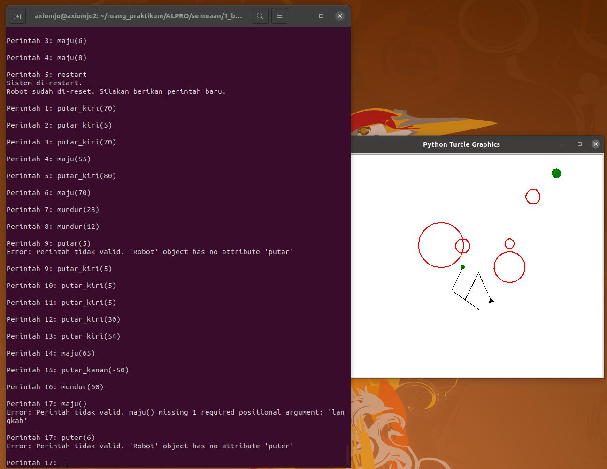

# Minggu 1: Basic Sequence 📝

Pertemuan ini memandu mahasiswa dari persiapan *environment* hingga mampu menulis skrip sekuensial sederhana yang terdokumentasi dengan baik.

## **Panduan Repository & Alur Kerja 🚀**

Selamat datang di repository praktikum\! Agar tidak bingung, semua folder telah disusun berdasarkan alur pengerjaan yang logis. Ikuti panduan ini untuk menavigasi folder dengan mudah.

-----

### **Isi Setiap Folder**

Berikut adalah penjelasan setiap folder sesuai urutan pengerjaannya:

  * **`materi_belajar/`**: **Mulai dari Sini.** Folder ini berisi buku panduan utama yang menjelaskan konsep-konsep penting untuk praktikum minggu ini.
  * **`soal_latihan/`**: **Baca Soalnya.** Setelah paham materi, lihat detail soal dan tugas yang harus dikerjakan di dalam folder ini.
  * **`jawaban_akhir/`**: **Tulis Jawabanmu.** Tempat kamu menulis dan menyimpan semua file jawaban, baik untuk soal materi (M1) maupun tugas (T1).
  * **`penguji_otomatis/`**: **Uji Jawabanmu.** Gunakan skrip *unit test* di sini untuk memeriksa apakah kodemu sudah benar secara otomatis sebelum dikumpulkan.
  * **`file_pendukung/`**: **Gunakan Bantuan.** Berisi file-file pendukung seperti skrip visualizer untuk membantumu mengerjakan dan memahami tugas.

-----

### **Peta Folder & File Penting**

Struktur ini menunjukkan di mana kamu bisa menemukan file-file penting:

```
.
├── materi_belajar
│   └── Panduan_ALPRO_pert1.md                # 1. Baca panduan praktikum di sini
│
├── soal_latihan
│   └── soal_prakALPRO_pert1_basic_sequence.md  # 2. Baca detail soalnya di sini
│
├── jawaban_akhir
│   ├── ... (buat file jawaban M1 di sini)    # 3a. Tulis jawaban Materi (M1) di sini
│   └── jawabanmu_T1_navigasirobot.py         # 3b. Tulis jawaban Tugas (T1) di sini
│
├── penguji_otomatis
│   └── test_T1_goalachieved.py               # 4. Uji jawaban T1 dengan skrip ini
│
├── file_pendukung
│   └── assetlab_T1_interactivemode.py        # 5. Lihat visualisasi T1 dengan skrip ini
│
└── ... (file dan folder lainnya)
```

---

## **Ringkasan Rencana Praktikum **

Praktikum ini dirancang untuk membekalimu dengan pondasi pemrograman Python dari nol, dengan alur sebagai berikut:

* **Langkah 0: Persiapan Lingkungan Kerja**
    Mahasiswa akan menginstal *software* esensial (VS Code, Python, Git) dan mempelajari alur kerja dasar Git/GitHub (`pull`/`push`) untuk manajemen dan pengumpulan tugas.

* **Langkah 1: Konsep Variabel & Tipe Data**
    Mengenalkan konsep fundamental **variabel** sebagai "wadah" penyimpan data dan tiga tipe data utama: **string** (teks), **integer** (bilangan bulat), dan **float** (bilangan desimal).

* **Langkah 2: Operasi Dasar dengan Operator Aritmetika**
    Mahasiswa akan belajar cara melakukan kalkulasi matematika dasar (`+`, `-`, `*`, `/`, `%`, `**`) pada variabel-variabel yang telah mereka buat.

* **Langkah 3: Dokumentasi Kode dengan Komentar**
    Mempelajari fungsi dan cara penulisan **komentar** (`#`) untuk membuat kode yang mereka tulis menjadi lebih jelas dan mudah dibaca oleh manusia.

* **Langkah 4: Mengerjakan Materi M1 dan Tugas T1**

-----


## ===== MATERI M1 ================================================  

### **1: Kalkulator Konversi Derajat ke Radian**
  


### **2: Kalkulator Torsi**
  


### **3: Kalkulator Gaya Coulomb**
  


## ===== TUGAS T1 ================================================  
DEADLINE: Jumat, 26 September 23:59 WIB
(kalau telat, gapapa, tetap dapat nilai, tapi kepotong 50%. tetap lebih baik telat daripada gak ngumpul. ) 

### **1: Navigasi Robot**
  


