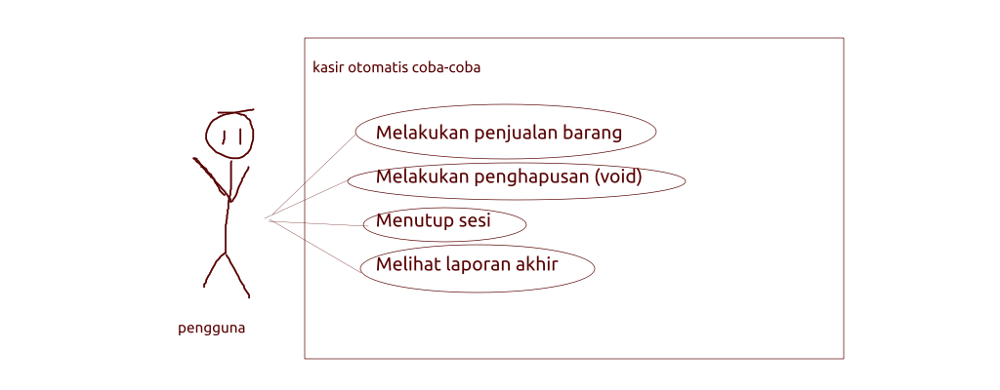

# TUTOR MBIKIN PROGRAM

## Skenario: Obrolan dengan Klien "Gaptek"

**Klien (Budi, Pemilik "Kafe Sederhana"):**
"Halo, Mas... Ini saya Budi. Gini, Mas, saya kan baru buka kafe kecil-kecilan di kenjeran. Jujur, saya pusing banget. Selama ini pake kalkulator sama buku catatan. Tiap malam rekap, pasti ada aja yang salah. Teman saya bilang, 'Udah, pake sistem kasir aja, jangan manual.'

Masalahnya, saya ini gaptek, Mas, wkwkwk. Liat yang di mal-mal itu kok kayaknya canggih banget, pusing saya.

Saya tuh maunya yang simpel aja. Pokoknya di layar ada: 1. Kopi, 2. Teh, 3. Roti. Udah, itu aja dulu. Nanti barista saya tinggal pencet. Kalo orang beli Kopi, dia pencet '1'. Nanti harganya langsung masuk. Terus dia pencet '3' buat Roti, harganya *nambah* sendiri. Jadi otomatis gitu, Mas, dia yang ngitungin.

Nah, ini yang penting, Mas\! Kadang kan barista saya salah pencet. Harusnya Kopi, kepencet Roti. Saya mau ada tombol 'BATAL'. Tapi cuma bisa batalin yang *terakhir* aja. Biar gampang. Jadi kalo dia salah pencet Roti, dia pencet 'BATAL', nanti total harganya balik lagi kayak sebelum Roti tadi. Jangan disuruh milih, pusing.

Terus, nanti kalo udah 5 kali transaksi (buat coba-coba dulu aja, Mas), programnya otomatis berhenti. Atau kalo saya mau tutup toko, saya pencet 'SELESAI' gitu.

Nah, pas programnya berhenti, saya mau dia cetak di layar. Kayak... 'Hari ini Jual Kopi 1, Jual Roti 1, Batal 1, Total Omsetnya Rp...' gitu. Kira-kira bisa gak, Mas? Dan jangan mahal-mahal ya, wkwkwk."

-----

## Rangkuman Kebutuhan 


**Proyek: Kasir Sederhana "Kafe 5 Aksi" (v0.1)**
**Tipe: Aplikasi Konsol (CLI) berbasis Teks**
**Batasan: Iterasi utama dibatasi hingga 5 *aksi* (bukan 5 penjualan).**

### Kebutuhan Fungsional (Functional Requirements)

1.  **FR-01: Tampilan Menu Utama**
      * Sistem harus menampilkan menu interaktif dalam *loop* yang konstan.
      * Menu harus menampilkan:
          * Opsi item (Kopi, Teh, Roti) beserta harganya (statis/hardcoded).
          * Opsi aksi (Void, Selesai).
          * Status saat ini (`total_omset` yang berjalan).
2.  **FR-02: Proses Penjualan**
      * Saat user memilih item (1, 2, atau 3), sistem harus:
          * Menambahkan harga item ke `total_omset`.
          * Menambahkan `jumlah_transaksi` sebanyak 1.
          * Mencatat transaksi ini ke *log* riwayat.
          * Mengatur *state* internal untuk VOID (lihat FR-03).
3.  **FR-03: Proses Void (Pembatalan)**
      * Sistem harus mampu membatalkan **hanya** transaksi penjualan terakhir.
      * **Guard Condition:** Aksi "Void" hanya bisa dieksekusi jika *state* internal `bisa_di_void == True`.
      * Jika dieksekusi (sukses):
          * `total_omset` harus dikurangi sejumlah `harga_transaksi_terakhir`.
          * `jumlah_transaksi` harus dikurangi 1.
          * *State* internal `bisa_di_void` harus di-set ke `False` (untuk mencegah *double void*).
          * Aksi "Void Sukses" harus dicatat di *log*.
      * Jika gagal (misal: `bisa_di_void == False`):
          * Sistem harus menampilkan pesan error ("Tidak ada yang bisa dibatalkan").
          * Aksi "Void Gagal" harus dicatat di *log*.
4.  **FR-04: Pencatatan Riwayat (Logging)**
      * **Setiap** aksi yang diambil user (Jual, Void Sukses, Void Gagal, Input Salah, Selesai) *harus* dicatat dalam satu *string* riwayat.
      * Format log harus jelas (misal: `Aksi 1: Jual Kopi - Rp18000`).
5.  **FR-05: Kondisi Berhenti (Exit Condition)**
      * Loop utama harus berhenti jika salah satu dari dua kondisi ini terpenuhi:
          * User memilih "Selesai".
          * Loop telah berjalan 5 kali (`for i in range(5)` selesai).
6.  **FR-06: Laporan Akhir**
      * Setelah loop berhenti, sistem *harus* mencetak laporan ringkasan yang berisi:
          * Total Omset Final.
          * Total Transaksi Berhasil Final.
          * Seluruh *string* riwayat yang telah dikumpulkan.

-----

2.  **State Machine Diagram (Diagram State Machine)**

      * **Mengapa?** Ini adalah diagram **paling penting** untuk masalah ini. Karena inti masalahnya adalah *state* (`bisa_di_void`).
      * **State:**
          * `Aman` (State awal, `bisa_di_void = False`)
          * `BisaVoid` (State setelah penjualan, `bisa_di_void = True`)
      * **Transisi/Event:**
          * `Aman` --(Event: Jual Barang)--\> `BisaVoid`
          * `BisaVoid` --(Event: Jual Barang)--\> `BisaVoid` (tetap di state ini, hanya `harga_terakhir` yang update)
          * `BisaVoid` --(Event: Void)--\> `Aman`
          * `Aman` --(Event: Void)--\> `Aman` (transisi gagal, tetap di state ini)

-----

## Arahan Pendesainan



### 1\. Variabel Kunci (State Kita)

Sebelum kalian ngetik `for`, definisikan "otak" dari program kita di paling atas. Ini adalah *source of truth* kita.

```python
total_omset = 0         # Ini total omset
jumlah_transaksi = 0    # Ini jumlah penjualan bersih
riwayat_transaksi = ""  # Ini buku catatan kita (string kosong)

# --- Ini bagian paling penting ---
harga_transaksi_terakhir = 0  # "Memori" harga barang yg baru dijual
bisa_di_void = False          # "Bendera" atau "Guard" kita.
```

### 2\. pseudocode?
klo ngestuck bilang ya, ntar baru dikasih pseudocode


### 3\. Alur Kerja (The Loop)

Kita pakai `for i in range(5)` sebagai *engine* FSM kita. Di *dalam* loop itu, kita lakukan 3 langkah **setiap saat**:

1.  **TAMPILKAN STATE:** `print(f"Omset: {total_omset}")` dan print menu.
2.  **DAPATKAN INPUT:** `pilihan = input(...)`
3.  **PROSES INPUT:** Gunakan `if/elif/else` besar untuk menangani `pilihan`.

### 4\. Fokus Utama: Logika VOID (FR-03)

Ini adalah bagian tersulit. Tolong jangan salah.

**Saat Menjual (Misal `pilihan == "1"`):**
Kalian *harus* melakukan 3 hal selain nambah omset:

1.  `riwayat_transaksi += "..."` (Catat di log)
2.  `harga_transaksi_terakhir = harga_kopi` (Simpan harganya untuk jaga-jaga di-void)
3.  `bisa_di_void = True` (Nyalakan bendera\! Sekarang tombol Void "aktif")

**Saat VOID (Misal `pilihan == "4"`):**
Kalian *harus* cek bendera **dulu**. Ini namanya *Guard Condition*.

```python
elif pilihan == "4":
    if bisa_di_void == True:
        # Sukses!
        total_omset = total_omset - harga_transaksi_terakhir
        jumlah_transaksi = jumlah_transaksi - 1
        riwayat_transaksi += "...Void Sukses..."
        
        # PENTING: Matikan lagi benderanya!
        bisa_di_void = False 
    else:
        # Gagal!
        print("Gagal VOID. Tidak ada yg bisa dibatalkan.")
        riwayat_transaksi += "...Void Gagal..."
```

### 5\. Jangan Lupa Lain-lain

  * **Pilihan "5" (Selesai):** Cukup panggil `break`. Jangan lupa catat di riwayat *sebelum* `break`.
  * **`else` (Input Salah):** Jangan lakukan apa-apa selain `print("Error")` dan catat di riwayat. Jangan `break`, jangan ubah `total_omset`.
  * **Laporan Akhir:** Kode `print` untuk laporan akhir harus ada di **LUAR** `for` loop.


